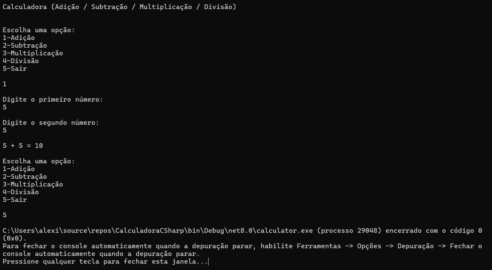
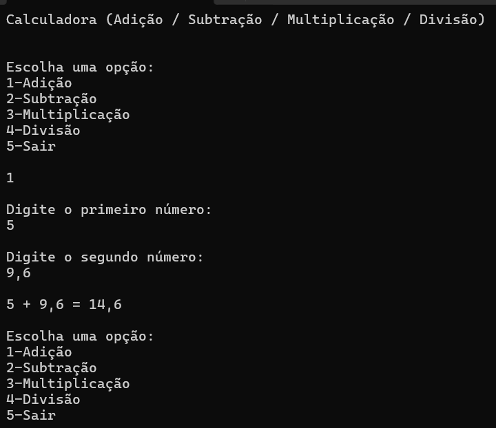
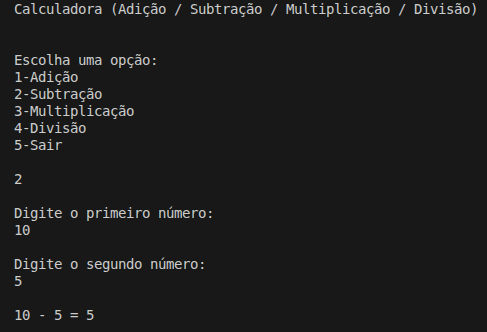
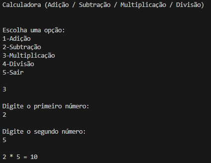
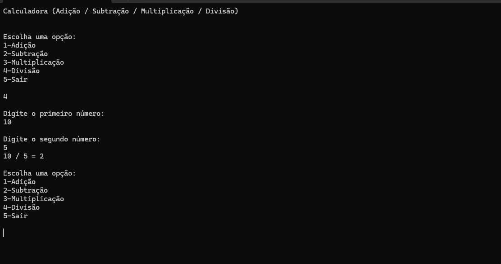

# Calculadora em C#

## Objetivo

Implementar uma calculadora de console com as seguintes operações:
- Adição
- Subtração
- Multiplicação
- Divisão

## Integrantes (maximo: 5 pessoas)

Preencha os nomes abaixo:

1. Alexia Ramalho
2. Enzo Real
3. Gustavo Pasquini
4. Hellen Aparecida
5. Lorenzo Acquesta

## Print da tela com o menu da calculadora

Inserir 1 print com as opcoes carregadas no console:
- 1 - Adicao
- 2 - Subtracao
- 3 - Multiplicacao
- 4 - Divisao

Exemplo de insercao de imagem:

```md

```

## Evidencias de teste (4 prints)

Inserir 4 prints, um para cada operacao, evidenciando o funcionamento correto:

1. Adicao
```md

```

2. Subtracao
```md

```

3. Multiplicacao
```md

```

4. Divisao
```md

```

## Checklist final de entrega

- [x] Nome dos integrantes preenchido (ate 5 pessoas)
- [x] Print do menu da calculadora adicionado
- [ ] Print de teste da adicao adicionado
- [ ] Print de teste da subtracao adicionado
- [ ] Print de teste da multiplicacao adicionado
- [ ] Print de teste da divisao adicionado
